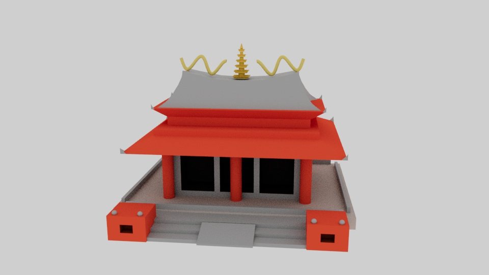

# Temple – Script Maya (Python)

Ce projet est un TP de modélisation procédurale réalisé en Python avec maya.cmds.
Le script génère automatiquement un temple bouddhiste taïwanais : socle, toits, colonnes, escalier, décorations, dragons sinusoïdaux et pagode.

# Aperçu

#Utilisation

- Ouvrir Autodesk Maya
- Charger HULLOT_Dounia_Temple.py dans le Script Editor
- Exécuter le script pour générer le temple

#Auteur

Dounia Hullot
Étudiante L3 en Arts et Technologies de l’Image (ATI – Paris 8)
